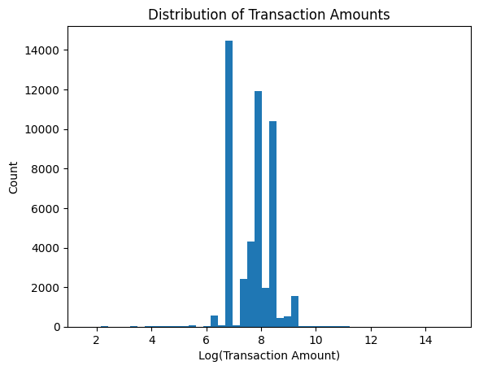
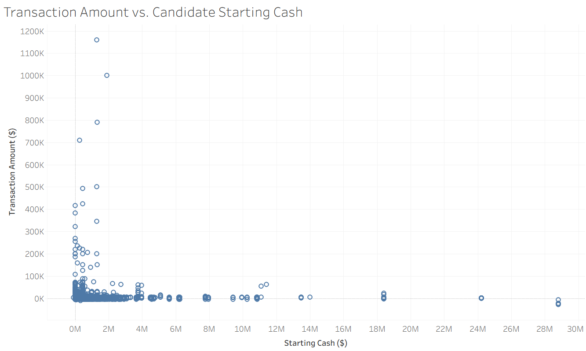

## CSC-466 Week 8: Final Project EDA
By: Nipun Das (nkdas@calpoly.edu)

### Dataset Choice
The dataset I am using is from the Federal Election Commission (FEC) spending data on PACs (Political Action Committees) and other committees, used on elections for political candidates. The dataset includes features about candidates, committees, as well as temporal data on the various types of spending by committees in each election cycle. I chose this dataset since it contains a large set of features about candidates and election data, and the interaction between committees and candidates allows for an interaction matrix to be built that can extract latent features about candidates or committees. Additionally, the Federal Election Commission is a reliable data source with access to significant election-related data because of the regulatory nature of the agency.

### Analysis
This dataset comes with tables for various committees, candidates, and spending. I decided to focus on PACs, since the FEC website displays that PACs generally make up the largest proportion of spending in elections. There are separate tables for candidates, PACs, and spending transactions. Many columns have missing values, but in most cases these are for more obscure features or in contexts where null values make sense (ex. where abscence can be interpreted as false, like with the special election column). The primary column with missing values of concern is the incumbendy status column, since 55 candidates are missing an incumbency status and as shown below, incumbency status is potentially a useful feature.

In a regression context, a key feature would be the actual transaction amounts between committees and candidates. In this case, it is a useful signal that we could use to build an interaction matrix between committees and PACs and "recommend" the committees that we believe would have the highest likelihood of donating to a candidate. Besides an interaction matrix, other models that try to predict donation amounts would have potential key features like political party affiliation, incumbency status, level of spending from opponents, and committee type amongst many others. The target in this case would be to predict committee donations to candidates that have not happened yet (since this is a temporal dataset), providing ranked predictions based on the model's predicted donation amount.

The first thing I decided to look at was the distribution of transaction amounts from contributions. As expected, this follows a distribution that is significantly right-skewed towards high contributions amounts, similar to many other monetary variables. As a result, I plotted using the log of transaction amount to get a visible graph.

Something else I decided to look at is the correlation between a candidate's starting cash (amount of money a candidate's principal campaign committee reports as having at the start of an election cycle) and transactions. I theorized that candidates who start off with more money may have more money in their accounts to start with because they need more cash for their election, leading to larger donations from committees. However, this does not appear to be the case, and the few cases of especialy large donations typically occur for candidates with a relatively low starting cash. There could be multiple explanations for this, such as the fact that candidates can have multiple authorized committees with cash.

Finally, I decided to look at if the incumbency status of the candidate influenced the transaction amounts. Typically, incumbents have an advantage when running against a challenger, as they often have higher name recognition and established experience to campaign on. From plotting the results, challengers interestingly typically have the highest transaction amounts, followed by those running for an open race, and then incumbents. This makes sense, since a challenger may require more funding to overcome the disadvantages against an incumbent. With open races, neither candidate has the incumbency advantage or the disadvantage of being a challenger, so it makes sense why the average transaction amount is in between the cases for challengers and incumbents. Incumbents often have an advantage and in some cases may even run unopposed (or without a serious challenger), which likely leads to many cases where spending for incumbent candidates is low.

One potential concern with this data is the sparsity of the interaction matrix between committees and candidates, with 2.16% of the values in the interaction matrix filled in. This may not be a sufficient density to perform matrix factorization and extract latent features about candidates or committees.
