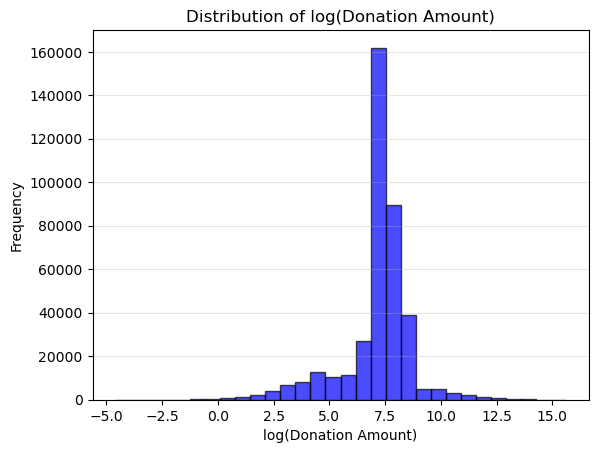
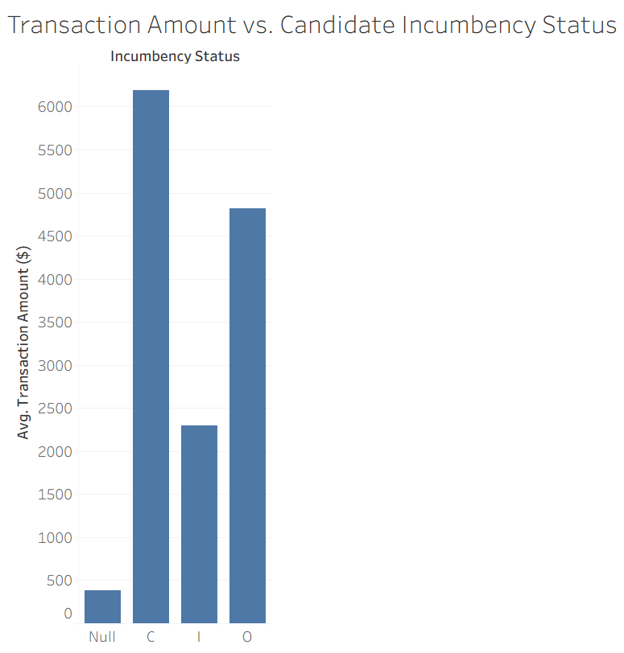
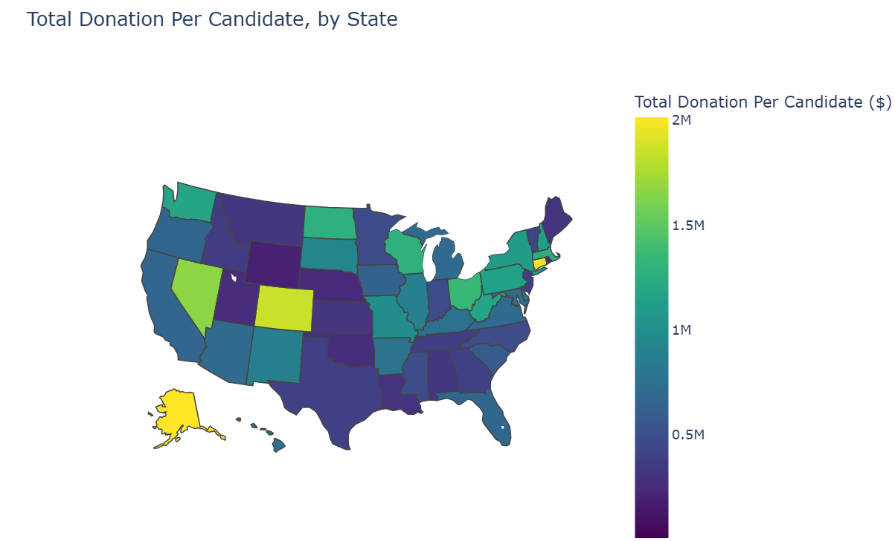
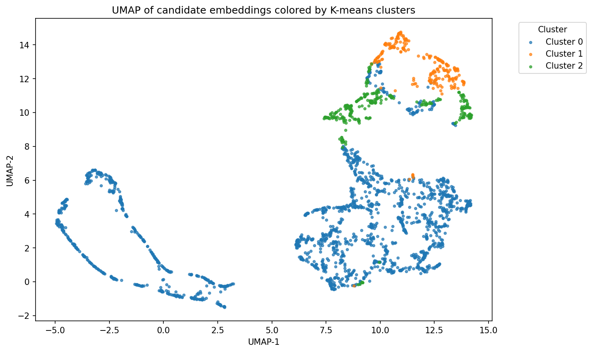

# Final Project Draft
By: Nipun Das (nkdas@calpoly.edu)

### Dataset
For this project, I analyzed the Stanford DIME (Database on Ideology, Money in Politics, and Elections) [dataset](https://data.stanford.edu/dime), a dataset that contains donations from individuals and political committees to political candidates. I initially started analyzing FEC data directly, but landed upon this dataset as it provides cleaned and aggregated data with a variety of features, whereas FEC datasets are more raw and require cleaning along with aggregation from other sources to generate useful features. Since the donation data represents interactions between candidates and committees, this data works nicely for creating an interaction matrix and building a "recommender" system.

I focused on the 2010 election cycle since the number of records after filtering (slightly under 400,000) was manageable for running models on my laptop, which was not the case with more recent election cycles. 

### Motivation
I believe analyzing this dataset is useful since it provides insight into political candidates through funding, which is often not highlighted in media to the same extent press conferences, scandals, and more engaging news stories are. Being able to predict who will donate to a candidate in the future can help us understand who funds a candidate, and clustering candidates into different categories can help us categorize candidates into different "personas" that may be indicative of how those candidates actually behave politically when they assume office.

### Task
By combining features about committees, candidates, and contributions, I created a contributions data frame that tracks contributions from committees to candidates for federal-level congressional races (Senate and House of Representatives). The contributions dataframe contains contributions for one election cycle, with contribution amounts, dates, committee ID, and candidate ID, amongst other features. The goal of this project is to predict future candidate/committee donation pairs within a single election cycle, based on prior donations for that cycle. It is similar to a recommendation problem besides the fact that donors actively choose candidates to donate to and aren't "recommended" them.

### Exploratory Data Analysis
From the exploratory data analysis that I did, I did observe a few things that I applied towards my models. For instance, the figure below shows how donation amounts, which are significantly right skewed, can be adjusted using a log transformation to make them more normally distributed. Since I didn't want large donation amounts to dominate small donation amounts too much (which still provide useful signal), I did end up using a log transformation on donation in my best final model (discussed below).

Another notable pattern is that incumbency status as a feature appears to have a significant association with donation amount. As seen in the bar chart below, the average transaction amount greatly varies across incumbency status. Incumbents (those currently holding office and running for re-election) have a much lesser average donation than challengers (those running against an incumbent). Open-race candidates (candidates in races that don't have an incumbent candidate) have an average donation higher than incumbents, but not quite as high as challengers. This could potentially be because incumbency is a significant political advantage and less donations might be needed as a result, but regardless of reason it appears to provide 

Finally, looking at contributions by state, there appears to be significant variation in the avarage donation amount per candidate, where certain states (like Alaska and Connecticut) have much higher average donations per candidate. One possibility is that race competitiveness influences donation amounts, such as with Alaska, where the 2010 senate race was especially competitive as a 3-way race between two republicans and a democrat. However, accounting for race competitiveness as a feature is challenging, as is discussed below.

### Models
To evaluate my models, I created a random baseline and a heuristic. The random baseline randomply picks contributors for each candidate, while the heuristic model functions similarly to popularity heuristics from content recommender system. Each committee is given a party label based on the political party they donated the most to, and then each candidate's predicted donors are simply the donors who have donated the most to the candidate's party.

The actual machine learning models I trained were a SVD collaborative filtering model, an ALS (Alternating Least Squares) collaborative filtering model, and a random forest regression model.

Both collaborative filtering algorithms are model-based CF algorithms, but they utilize different techniques to perform matrix factorization. The surprise-based SVD collaborative filtering model gets ratings on a 0-1 scale by min-max scaling each committee vector. For the ALS collaborative filtering model, I used a log transformation on the donation amount to create a score in the interaction matrix, based on the observed right-skew distribution of donation amounts in EDA. I chose to use ALS for one of my models since from my research, it is supposed to work better for implicit ratings compared to SVD, and donation amount is definitely more of an implicit rating compared to watch proportion from content recommendations. Intutitively, min-max scaling donation amounts doesn't really make sense as being equivalent to explicit ratings, since lower donation amounts aren't actually negative signal, just weaker signal. For this reason, I expected collaborative filtering with SVD to perform worse than collaborative filtering with ALS. I did also experiment with making all interaction matrix values equal to 1 (regardless of donation amount) for SVD collaborative filtering to mitigate the issue of lower donation amounts being interpreted as negative signal, but this did not change the evaluation metrics much.

The random forest model uses regression on the provided features about candidates and committees to predict donation amounts, which is then used to rank potential donors by the donation amount and "recommend" the donors with the highest predicted donations. Some of the features used include election type (ex. primary vs. general), candidate party, candidate state, committee state, and incumbency status. Additionally, I engineered two more features based on the training data: committee party (based on which party the committee donated the most to) and median committee donation amount.

### Evaluation
The evaluation results are shown below. The heuristic performs significantly better than random, as expected. The collaborative filtering model with SVD performs worse than the heuristic and roughly the same as random, which confirmed my suspicions that using min-max scalings and treating donations as explicit ratings would lead to poor results. In contrast, the ALS collaborative filtering model performs the best out of all models, significantly beating the heuristic in Precision@20, Recall@20, and MAP@20. Finally, the random forest model performs close to the baseline, which I believe is due to flaws with the provided features (discussed below).

### Future Steps
I think the best future steps to create a better donation "recommender" (really, predictor) would be to enhance the ALS collaborative filtering model using features about the candidates and committees. This would probably involve improving the random forest model (and generally any committee/candidate feature-based models) first. I believe the reason why the random-forest algorithm struggled was because of the features used. Because of how I framed the problem (predicting future donations within an ongoing election cycle), many numerical features which were aggregated for the entire election cycle could not be used. For example, the total number of contributors to a candidate or the total amount of donations dispersed by a committee are features that are only known by the end of an election cycle, and using them in my random forest regressor would have created temporal leakage. Race competitiveness might have been an influential factor based on my EDA, but final election results (which is what I had to work with in this dataset) also would have created temporal leakage.

I think one potential solution to this issue would be to reframe the problem so that donations for a future election cycle are predicted based on previous election cycles, but this would significantly change the framing of the original problem and require more records to be processed. Additionally, I anticipate that the issue of "cold starts" with new committees or candidates probably becomes more significant when looking at new election cycles rather than predicting donations midway through a single election cycle. The other alternative would be to see if any numerical features can be engineered to avoid temporal leakage, such as rolling total contribution amount/total contributors features for committees and candidates respectively. These, along with the existing categorical features like location and incumbency status, would likely help improve the candidate/committee feature-based recommenders. Finding other sources of data could allow for more informative features as well. In the case of race competitiveness, polling data would measure this for any point in an election cycle, and thus could be used without creating temporal leakage.

Finally, an ensemble hybrid model that combines ALS collaborative filtering with a committee/candidate feature model (ex. random forest or XGBoost) would probably improve significantly from my current ALS model and provide much better results. Beyond this, I think doing more clustering analysis from ALS embeddings of candidates or committees would help analyze broader patterns in the data and gain more insight into the monetary side of politics. I did start performing some clustering analysis (see UMAP of candidate embeddings below), but extracting descriptive information about clusters below would probably require more descriptive features about candidates and committees that have meaning in the world of politics, something which is not available in this dataset. For instance, features about the industries committees are associated with or the specific political leanings of candidates (more specific than political party) would allow us to better describe clusters in a way that applies to the domain of politics.

