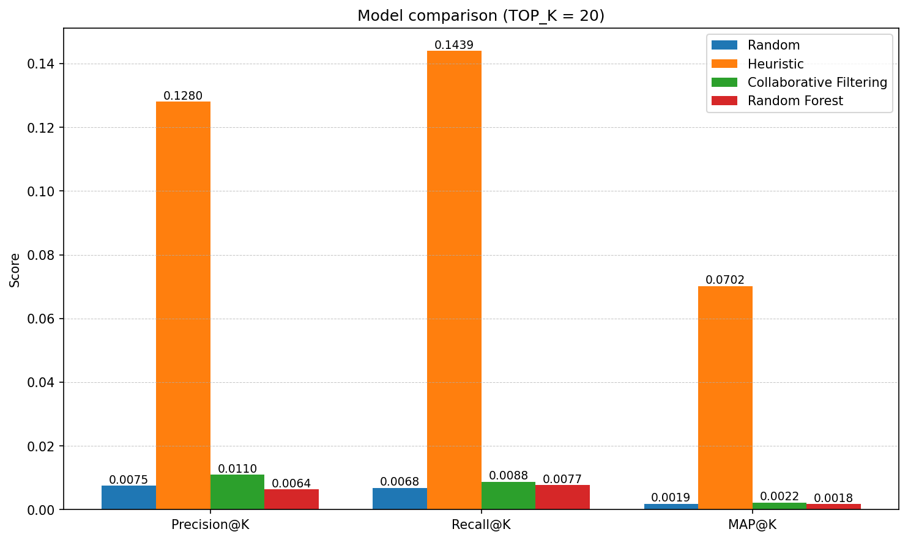

# Final Project Draft
By: Nipun Das (nkdas@calpoly.edu)

### Dataset
For this project, I analyzed the Stanford DIME (Database on Ideology, Money in Politics, and Elections) (dataset)[https://data.stanford.edu/dime], a dataset that contains donations from individuals and political committees to political candidates. I initially started analyzing FEC data, but landed upon this dataset as it provides cleaned and aggregated data with a variety of features, whereas FEC data is more raw. Since the donation data represents interactions between candidates and committees, this data works nicely for creating an interaction matrix and building a recommender system.

### Motivation
I believe analyzing this dataset is useful since it provides insight into political candidates through funding, which is often not highlighted in media to the same extent press conferences, scandals, and more engaging news stories are. Being able to predict who will donate to a candidate in the future can help us understand who funds a candidate, and clustering candidates into different categories can help us categorize candidates into different "personas" that may be indicative of how those candidates actually behave politically when they assume office.

### Task
By combining features about committees, candidates, and contributions, I created a contributions data frame that tracks contributions from committees to candidates for federal-level congressional races (Senate and House of Representatives). The contributions dataframe contains contributions for one election cycle, with contribution amounts, dates, committee ID, and candidate ID, amongst other features. The goal of this project is to predict future candidate/committee donation pairs, based on prior donations. It is similar to a recommendation problem.

### Models
To evaluate my models, I created a random baseline and a heuristic. The random baseline randomply picks contributors for each candidate, while the heuristic model functions similarly to popularity heuristics from content recommender system. Each committee is given a party label based on the political party they donated the most to, and then each candidate's predicted donors are simply the donors who have donated the most to the candidate's party.

The actual machine learning models I trained were a SVD collaborative filtering model, an ALS (Alternating Least Squares) collaborative filtering model, and a random forest regression model.

Both collaborative filtering algorithms are model-based CF algorithms, but they utilize different techniques to perform matrix factorization. The surprise-based SVD collaborative filtering model gets ratings on a 0-1 scale by min-max scaling each committee vector. For the ALS collaborative filtering model, I used a log transformation on the donation amount to create a score in the interaction matrix, based on the observed right-skew distribution of donation amounts in EDA. I chose to use ALS for one of my models since from my research, it is supposed to work better for implicit ratings compared to SVD, and donation amount is definitely more of an implicit rating compared to watch proportion from content recommendations. Intutitively, min-max scaling donation amounts doesn't really make sense as being equivalent to explicit ratings, since lower donation amounts aren't actually negative signal, just weaker signal. For this reason, I expected collaborative filtering with SVD to perform worse than collaborative filtering with ALS. I did also consider 

The random forest model uses regression on the provided features about candidates and committees to predict donation amounts, which is then used to rank potential donors by the donation amount and "recommend" the donors with the highest predicted donations.

### Evaluation
The evaluation results are shown below. The heuristic performs significantly better than random, as expected. The collaborative filtering model with SVD performs worse than the heuristic and roughly the same as random, which confirmed my suspicions that using min-max scalings and treating donations as explicit ratings would lead to poor results. In contrast, the ALS collaborative filtering model performs the best out of all models, significantly beating the heuristic in Precision@20, Recall@20, and MAP@20. Finally, the random forest model performs close to the baseline, which I believe is due to flaws with the provided features (discussed below).

### Future Steps
I think the best future steps to create a better donation "recommender" (really, predictor) would be to enhance the ALS collaborative filtering model using features about the candidates and committees. This would probably involve improving the random forest algorithm (and generally any committee/candidate-based models) first. I believe the reason why the random-forest algorithm struggled was because of the features used. Because of how I framed the problem (predicting future donations within an ongoing election cycle), many numerical features which were aggregated for the entire election cycle could not be used. For example, the total number of contributors to a candidate or the total amount of donations dispersed by a committee are features that are only known by the end of an election cycle, and using them in my random forest regressor would have created temporal leakage.

I think one potential solution to this issue would be to reframe the problem so that donations for a future election cycle are predicted based on previous election cycles, but this would significantly change the framing of the original problem and require more records to be processed. Additionally, the issue of "cold starts" with new committees or candidates probably becomes newer when looking at new election cycles rather than predicting donations midway through a single election cycle. The other alternative would be to see if any numerical features can be engineered to avoid temporal leakage, such as rolling total contribution amount/total contributors features for committees and candidates respectively. These, along with the existing categorical features like location and incumbency status, would help improve the candidate/committee feature-based recommenders.

Another future step that could be taken is using the embeddings from ALS matrix factorization for clustering. Since ALS matrix factorization appears to perform fairly well on the dataset, it is likely that the embeddings from the model provide a useful repesentation of candidates. Performing clustering using K-means clustering could provide us insights into different types of candidates, such as candidates who might rely on multiple smaller contributions compared to candidates that rely on large corporate donors. This would provide insight into more general patterns in the data, in addition to specific predictions of the machine learning algorithms.
