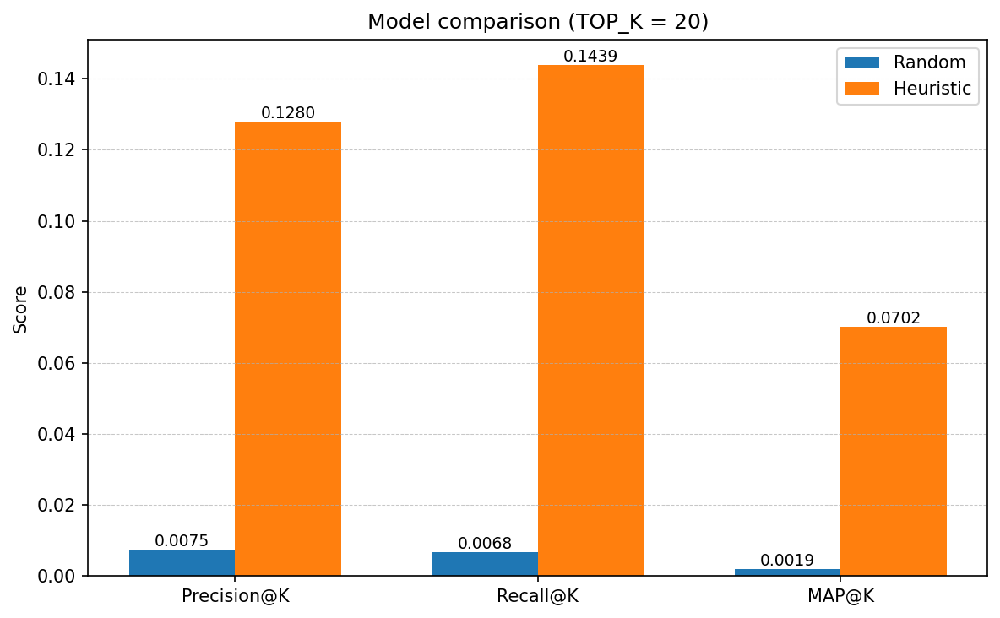

# Final Project Draft
By: Nipun Das (nkdas@calpoly.edu)

### Dataset
After doing some research, I decided to pivot away from the FEC dataset that I performed EDA on last week. The dataset is fairly raw and requires some cleaning and normalization, and there are other more refined datasets that aggregate FEC data with other sources to get more useful features. Ultimately, I chose the Stanford DIME (Database on Ideology, Money in Politics, and Elections) (dataset)[https://data.stanford.edu/dime] since it contains a variety of useful features and is also up-to-date as of the 2024 election cycle, which is not the case with OpenSecrets and other election spending datasets.

### Task
By combining features about committees, candidates, and contributions, I created a contributions dataframe that tracks contributions from committees to candidates for federal-level congressional races (Senate and House of Representatives). The contributions dataframe contains contributions for one election cycle, with contribution amounts, dates, committee ID, and candidate ID, amongst other features. The goal of this project is to predict future candidate/committee donation pairs, based on prior donations. It is similar to a recommendation problem.

### Models
The models I trained were a random baseline model and a heuristic model. The random baseline simply randomly predicts donatinos, while the heuristic model works similarly to the popularity heuristics from the content recommenders in this class. For each candidate, the predicted most likely contributors are the committees that have donated the most to the political party the candidate is a part of.

### Evaluation
The evaluation results are shown below. As expected, the heuristic model significantly outperforms the random baseline in all metrics, with a MAP@20 of 0.0702 compared to the random baseline of 0.0019.

### Future Steps
The heuristic model performs well since it uses "frequent" contributors to predict who are most likely to contribute in the future, while taking political party into account. However, to get more specific, a collaborative filtering model or contributor/candidate feature-based model would probably be better predictors given the task at hand is a recommendation task. Features such as geographical location of the candidate and committee will likely be useful, and from the EDA last week, the incumbency status is also likely to be a useful feature that isn't taken into account with the heuristic model.
